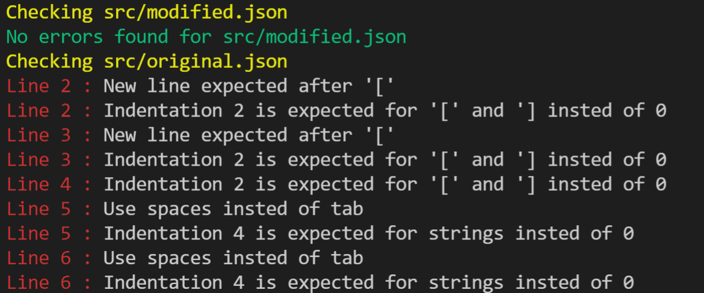
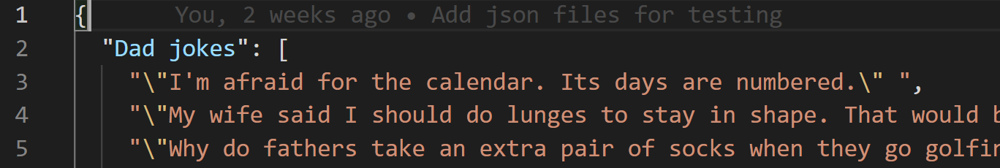
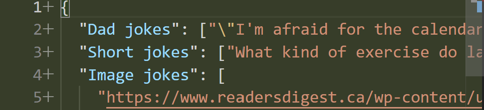
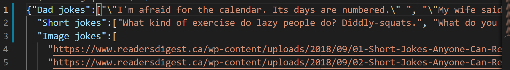
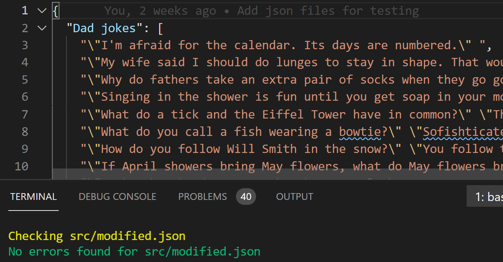
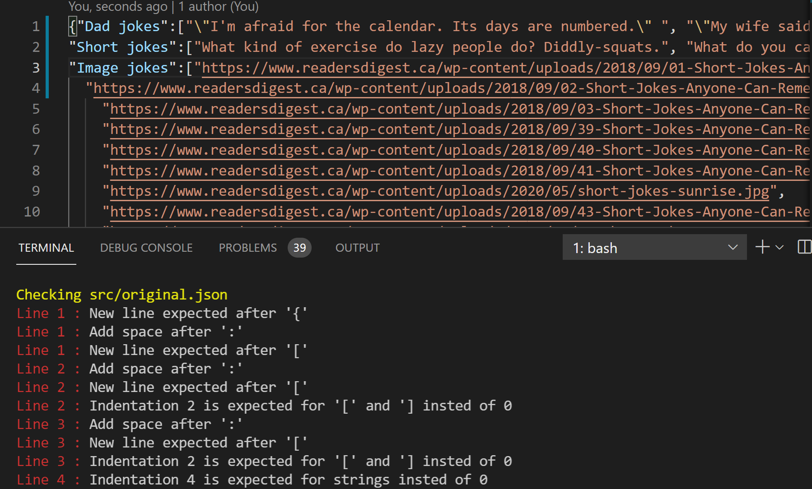

# Linters_for_JSON
This is a linters built to flag errors in JSON files. It checks for indentation rules, the appropriateness in the use of spaces, the use of new lines square brackets,and proper use of spacing.

# Development Milestones

- Milestone 1: Project setup was performed as described in the requirements.
- Milestone 2: Created the `bin/main.rb` file for the JSON Linters project.
- Milestone 3: Added the linters rules in the file `lib/rules.rb`.
- Milestone 4: Run Rspec test.

## Built With

- Ruby
- Git flow
- GitHub

### Prerequisites

- Terminal (Bash)
- Git
- Ruby (with colorize gem)

### Setup: How to use the JSON Linters

- clone my repo: `git clone https://github.com/Chike1990/linters_test`
- cd into: `cd linters_test/bin`
- run `main.rb`

### How to this JSON linters works:

This linters checks for errors in JSON files. The things it checks are listed and explained below:

- first_line
The first line is expected to start with a curly brace as shown in the image below. Where this expectation is not met, error message will be displayed for the first line.

- after_curly
Also, a new line is expected after the curly brace as shown in the image below; otherwise, the system prints error message for the line number.
Good code:

Bad code:

- after_colon
A new line is expected after a comma and where it is omitted, the application flags error on that line.
Good code:

Bad code:

- after_square_bracket  &  indentation
A new line with two indentation is expected after square brackets. Otherwise, error message will be printed for the line(s) affected.
Good code:

Bad code && Sample error message

## Authors
👤 Chibuike Uzoechina 

- GitHub: [@Chike1990](https://github.com/Chike1990)
- Twitter: [@ChibuikeUzoechi](https://twitter.com/ChibuikeUzoechi)
- LinkedIn: [@Chibuike-Uzoechina](https://www.linkedin.com/in/chibuike-uzoechina-630857102)

## 🤝 Contributing

Contributions, issues, and feature requests are welcome!

Feel free to check the [issues page]

## Show your support

Give a ⭐️ if you like this project!

## Acknowledgments

- Many thanks to Microverse
- friends
- our standup team

## 📝 License

This project is [MIT](LICENSE) Licensed.
